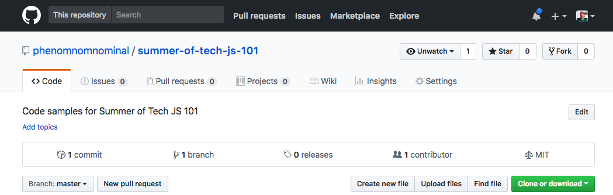
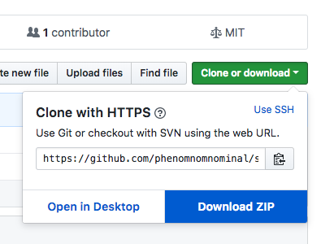

# Github!

Now that we have our way around the Dev Tools a little bit, let's get ourselves set up with the project! We will be using [Github](https://github.com) to get the code and instructions.

## What is it?

Github is a huge website for the public sharing of code (and other stuff too)! It is built on top of [Git](https://git-scm.com/), an incredibly popular distributed [version control system](https://en.wikipedia.org/wiki/Version_control). It has thousands of open source projects from developers all over the world.

Code is stored in a *repository*, and can be *forked* to make changes, which can then be *merged* back into the repository! We won't be going into any details about Git today, but there's a tonne of info online if you are curious.

## Try it out!

First, go to the main page of this repository at https://github.com/phenomnomnominal/summer-of-tech-js-101.

Then you need to click the "**Clone or download**" button.

Finally, click the "**Download ZIP**" button.

This will download the whole repository to your computer.

If you unzip the ZIP file, you should see all the instructions for this workshop, as well as some code to get started!

Once you've done that, you can move on to the next step to learn all about the  [**index.html**](./03 - index.html.md). 👏👏👏

## More info:

We haven't got time to go into *Git* today, but if you're looking for a good introduction, you could check out [Try Git](https://try.github.io/levels/1/challenges/1).
