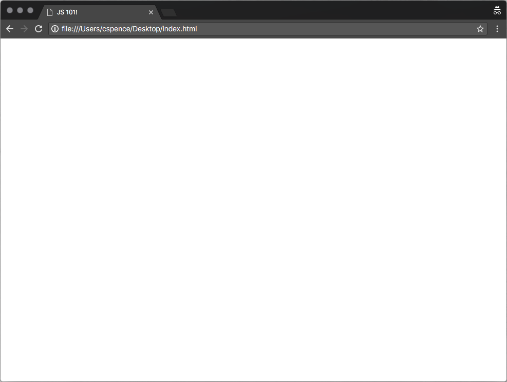

# index.html!

So now we have a copy of the repository on our computers, we can get started writing some code. First, we're going to look at the *index.html* file!

## What is it?

An *index.html* file is the entry point to a website! It contains the *markup* (written in [HTML](https://developer.mozilla.org/en-US/docs/Web/HTML)) for the document or application, and it looks something like this:

```html
<!doctype html>
<html lang="en">
    <head>
        <meta charset="utf-8">

        <title>JS 101!</title>
    </head>

    <body></body>
</html>
```

You'll find an *index.html* file just like the above in the *./src* folder of this project.

## Try it out!

We want to open the *index.html* in Google Chrome. One easy way to do this is to just drag the file over the browser and drop it!

You should see a blank page with the title set to "**JS 101!**", like this:



## Next

When you've got that running, you're ready to go onto the next step,   [**Variables**](./04%20-%20Variables.md). 👏👏👏

## More info:

[HTML](https://developer.mozilla.org/en-US/docs/Web/HTML) is a hugely powerful language by itself. There are lots of HTML tutorials online, but I particularly like the [Codecademy course](https://www.codecademy.com/learn/learn-html)!
