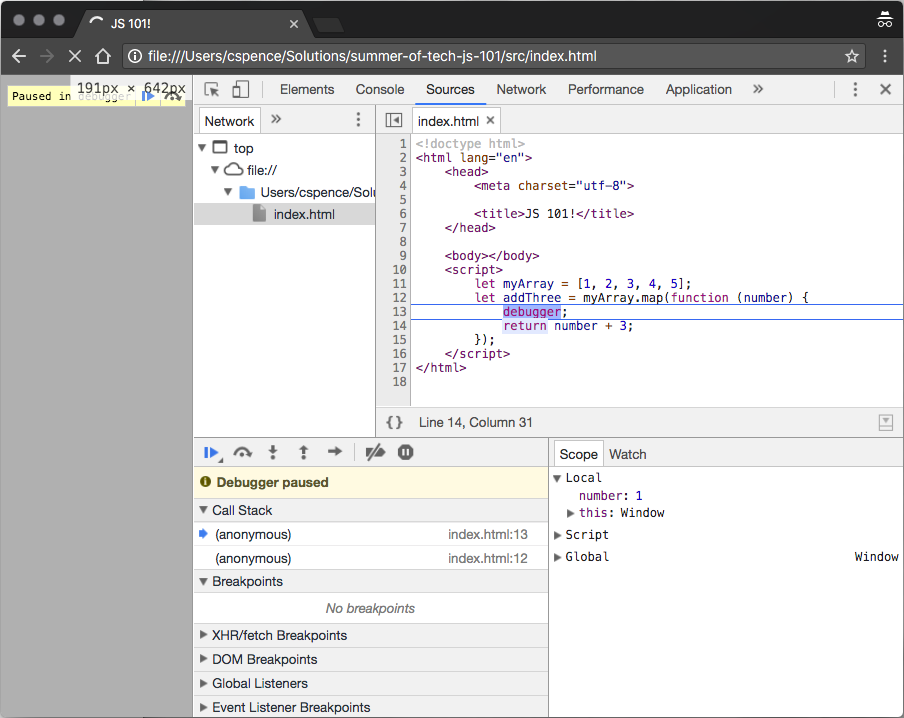
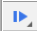

# Arrays!

Sometimes you want to be able to use a *group* of objects. Arrays are perfect for that!

## What are they?

An [**Array**](https://developer.mozilla.org/en-US/docs/Web/JavaScript/Reference/Global_Objects/Array) is a special type of object, where each property name is a number!

They look something like this:

```javascript
let myArray = [1, 2, 3, 4, 5];
```

You can then access values from the Array like this:

```javascript
console.log(myArray[0]);
```

The first value in the array lives at position `0`. We say that JavaScript arrays are "**zero-indexed**".

An array can contain anything you like, even other arrays!

Arrays are particularly powerful because you can use their **methods** to manipulate the array. Some of the different methods are as follows...

### `foreach`:

```javascript
myArray.forEach(function (number) {
    console.log(number);
});
```

### `map`:

```javascript
let squared = myArray.map(function (number) {
    return number * number;
});
```

### `reduce`:

```javascript
let sum = myArray.reduce(function (previous, next) {
    return previous + next;
}, 0);
```

The important thing to notice here is that we are calling a function (e.g. `reduce`), and we are giving it another function! This can take a bit to get your head around the first time you see it. Think of it like asking someone to do something generic ("folding washing"), but giving specific instructions ("only fold my t-shirts"). The function that you pass is the specific instructions.

## Try it out:

Have a go at creating your own array.

* What happens if you create an array with objects inside it?
* Can you figure out a way to get the *last* item in an array?
* What other array methods are there? Have a go at using `reverse()`, or `join()`. And then try out `filter()`!

Chances are that something will not work when you're trying this! You may need to use a `debugger` statement to see what is going on! That might look something like this:



A `debugger` statement tells the dev tools to stop the program as it is running! This lets us look at what is going on, and hopefully figure out the bug! You can hit the "**play**" button to continue running your code:



## Next

Once you're done playing with arrays, move on to the next section [**Control Flow**](./10%20-%20Control%20flow.md).

## More info:

There's a lot of information about JavaScript arrays online. [This article](https://medium.com/learning-new-stuff/5-array-methods-all-javascript-beginners-should-know-48b5795d77f8) is particularly useful for getting your head around the different Array methods.
